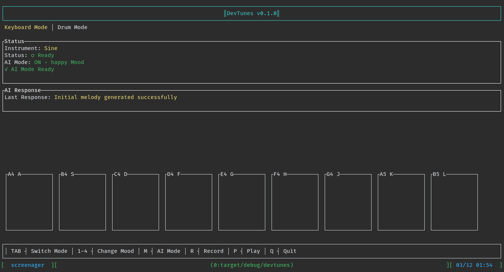

# 🎵 DevTunes

A terminal-based musical instrument and drum machine written in Rust. Create music, play beats, and record your compositions right in your terminal!



## ✨ Features

- 🎹 Musical keyboard with 9 notes (A-L keys)
- 🥁 Drum machine with 5 different sounds
- 🎛️ Multiple waveform types (Sine, Square, Triangle, Saw)
- 🎼 Record and playback functionality
- 👾 Beautiful terminal UI using Ratatui
- 🎧 Real-time audio synthesis

## 🚀 Quick Start

### Prerequisites

- Rust and Cargo ([install from rustup.rs](https://rustup.rs/))
- Audio development files (Linux only)

#### Linux Dependencies

Ubuntu/Debian:
```bash
sudo apt-get install libasound2-dev
```

Fedora:
```bash
sudo dnf install alsa-lib-devel
```

### Installation

```bash
# Clone the repository
git clone https://github.com/yourusername/devtunes.git

# Enter the project directory
cd devtunes

# Run the application
cargo run
```

## 🎮 Controls

### General
- `Q` - Quit application
- `TAB` - Switch between keyboard and drum modes

### Instruments
- `1` - Sine wave
- `2` - Square wave
- `3` - Triangle wave
- `4` - Saw wave

### Recording
- `R` - Start/stop recording
- `P` - Play recorded sequence

### Keyboard Mode
Keys `A` through `L` play different notes:
```
A - A4 (440 Hz)
S - B4 (493.88 Hz)
D - C4 (523.25 Hz)
F - D4 (587.33 Hz)
G - E4 (659.25 Hz)
H - F4 (698.46 Hz)
J - G4 (783.99 Hz)
K - A5 (880.00 Hz)
L - B5 (987.77 Hz)
```

### Drum Mode
- `Z` - Kick drum
- `X` - Snare
- `C` - Hi-hat
- `V` - Clap
- `B` - Cymbal

## 🛠️ Building from Source

```bash
# Build in release mode
cargo build --release

# Run the release version
./target/release/devtunes
```

## 🧪 Development

Contributions are welcome! Here's how to set up the development environment:

```bash
# Clone the repository
git clone https://github.com/tejas242/devtunes.git

# Enter the project directory
cd devtunes

# Run with debug output
RUST_LOG=debug cargo run
```

## 📝 License

This project is licensed under the MIT License - see the [LICENSE](LICENSE) file for details.

## 🤝 Contributing

1. Fork the repository
2. Create your feature branch (`git checkout -b feature/AmazingFeature`)
3. Commit your changes (`git commit -m 'Add some AmazingFeature'`)
4. Push to the branch (`git push origin feature/AmazingFeature`)
5. Open a Pull Request

## 📚 Acknowledgments

- Built with [Ratatui](https://github.com/tui-rs-revival/ratatui) for the terminal interface
- Audio synthesis powered by [rodio](https://github.com/RustAudio/rodio)

---

Made with ❤️ and 🦀 Rust
